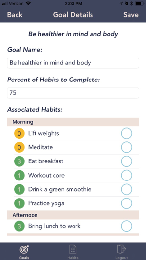

# Habitz
Habitz is an iOS app designed to help people form positive habits that support their larger life goals.

## Background
This project aims to solve the problems we all encounter when trying to start a new habit or accomplish some larger life goal.

Maybe it's not knowing where to start. Or maybe it's feeling like you keep trying and working but aren't making progress. There are a number of reasons why we struggle with change, and Habitz aims to be the honest and supportive partner in overcoming those challenges.

## How it Works
Users create goals, and then assign habits to those goals. The goals are meant to be general and ambitious, meaning they may be hard to measure or define as 'completed' - such as eating healthier, or spending more time with family.

That's where habits come in. Habits are meant to be specific and measurable, and they should be a way to support some goal. They should be the things you can do each day that are characteristic of you succeeding in your goals.

Put simply - the goal is the reason, and the habits are the actions.

### Inspiration
This project was inspired based on personal struggles for self-improvement (having to use multiple habit managing apps and spreadsheets / text docs) and two excellent books:
 - [*The Power of Habit*, Charles Duhigg](https://www.amazon.com/Power-Habit-What-Life-Business/dp/081298160X)

 - [*Thinking Fast and Slow, *Daniel Kahneman](https://www.amazon.com/Thinking-Fast-Slow-Daniel-Kahneman/dp/0374533555)

## Challenges
The project was built over a two week timeline, and there were a number of challenges encountered. Three of the most interesting ones were:
 - AWS services integration - being this was my first time using AWS, it took some time and research to figure out how to set up and configure all the services properly in order to have access to each other

 - Lambda containers and database access via Knex and Postgres - there were initially complications where a call to the database would fire, which caused errors with the Lambda container because it could not 'end' its function call

 - Daily reset - the solution put in place was to perform a reconciliation based on the current day. Each time the app is opened, all habits and goals are pulled, and then they are compared against all COMPLETED habits and goals. This allows the view to reset each day, but I will be looking at other implementations based on backlogged user stories.

## Features

Any goals or habits a user creates will be shown in their main goals and habits lists respectively.

Goals List | Habits List
--------- | ----------
 | 

Goals and habits are created using standard text inputs and picker wheels.

Since a goal has many habits, a detailed goal provides a quick way to see all habits. This uses the same component as the 'all habits' list, meaning users can mark their habits complete here in the detail list if they would prefer.

Create Habit | Goal Details
------------ | ------------
 | 


<!-- ## Getting Started

These instructions will get you a copy of the project up and running on your local machine for development and testing purposes. See deployment for notes on how to deploy the project on a live system.

### Prerequisites

What things you need to install the software and how to install them

```
Give examples
```

### Installing

A step by step series of examples that tell you have to get a development env running

Say what the step will be

```
Give the example
```

And repeat

```
until finished
```

End with an example of getting some data out of the system or using it for a little demo -->

<!-- ## Running the tests

Explain how to run the automated tests for this system

### Break down into end to end tests

Explain what these tests test and why

```
Give an example
```

### And coding style tests

Explain what these tests test and why

```
Give an example
``` -->

<!-- ## Deployment

Add additional notes about how to deploy this on a live system -->

## Built With

* [Swift](https://developer.apple.com/swift/) and [UIKit framework](https://developer.apple.com/documentation/uikit) - iOS development
* [Node](https://nodejs.org/en/) and [Express](https://expressjs.com/) - development server
* [Alamofire](https://github.com/Alamofire/Alamofire) and [SwiftyJSON](https://github.com/SwiftyJSON/SwiftyJSON) - HTTP networking and JSON parsing
* [Firebase](https://firebase.google.com/docs/auth/) - user authentication
* [Amazon RDS](https://aws.amazon.com/rds/) - relational cloud data storage, using [Postgres](https://www.postgresql.org/)
* [AWS Lambda](https://aws.amazon.com/lambda/) - functions as a service, route handling and database access
* [Amazon API Gateway](https://aws.amazon.com/api-gateway/) - routing, management of API endpoints


## Authors

* **Ryan Wittrup** - [Github](https://github.com/wittrura), [Personal Site](http://www.ryanwittrup.com/)

## Acknowledgments

* [Charles Duhigg](https://www.amazon.com/Power-Habit-What-Life-Business/dp/081298160X) and [Daniel Kahneman](https://www.amazon.com/Thinking-Fast-Slow-Daniel-Kahneman/dp/0374533555) for inspiration
